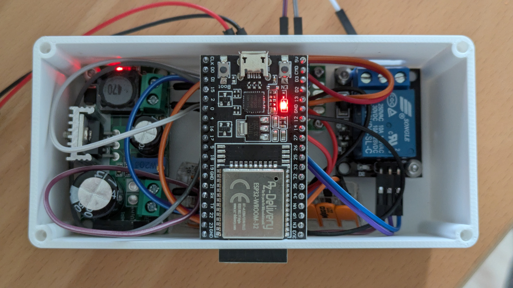
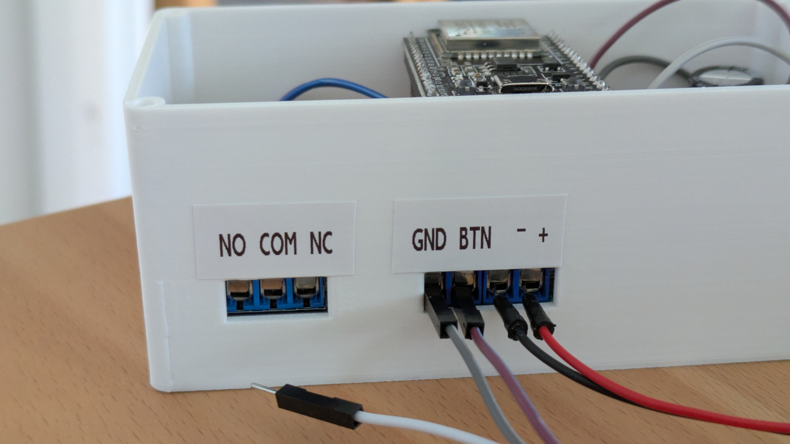
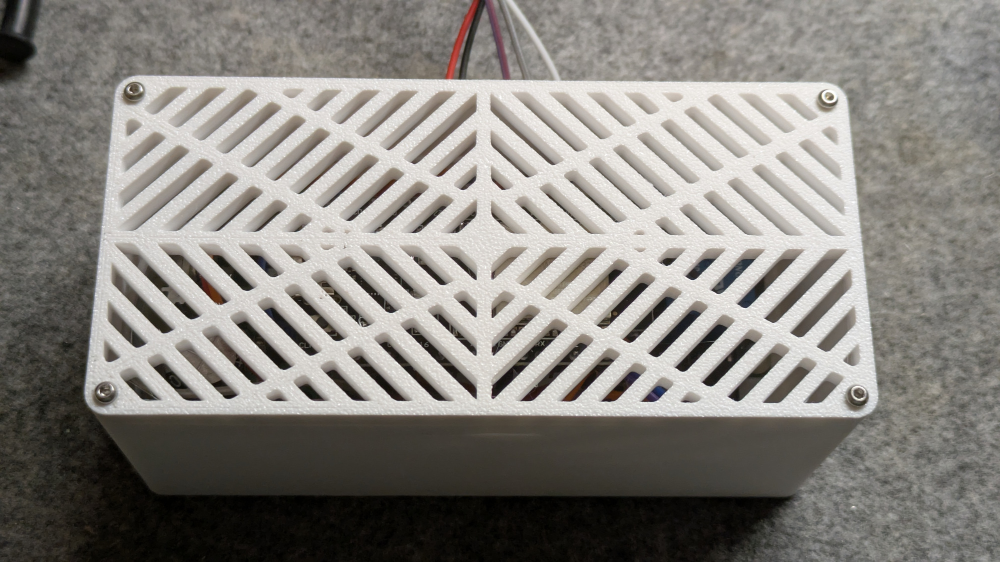
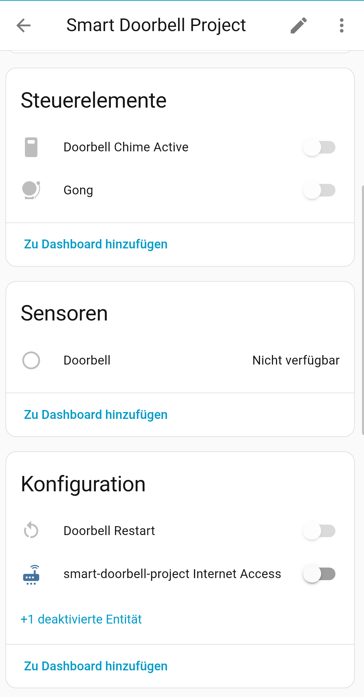
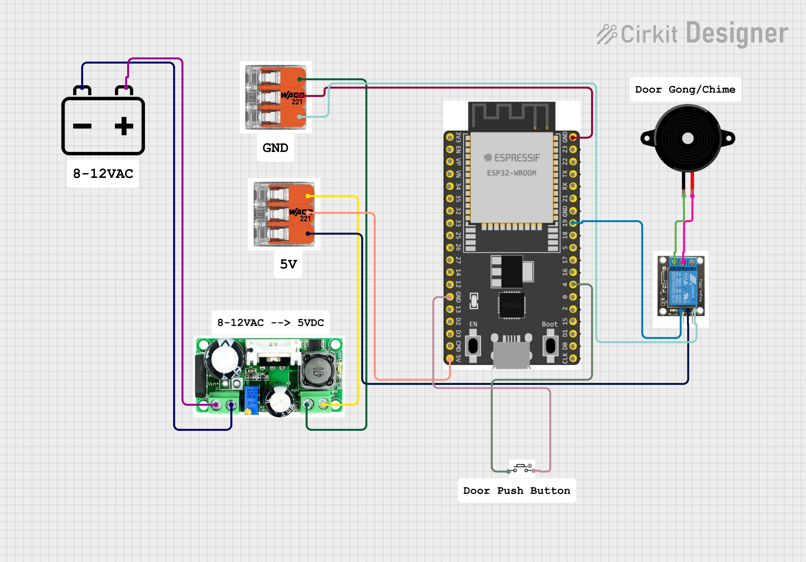

# Smart Doorbell Project

This smart doorbell project transforms a traditional doorbell into an intelligent system using ESPHome and Home Assistant integration. The system detects doorbell button presses and activates a relay-controlled chime while providing remote control capabilities. 

Doorbell detections can be used for home assistant automations such as taking a photo with your existing security camera on-press and send it with a notification to your mobile devices. You can also deactivate the gong/chime at times where you need silence.

Some ideas come from the excellent work of [Marcel Zuidwijk](https://www.zuidwijk.com/esphome-based-doorbell/).

### Visuals
More images are in the img folder.








### Features
- Detects button presses via GPIO input with debouncing to avoid false positives
- Enable/disable chime remotely via Home Assistant in case you need silence
- Connects to home network with fallback hotspot
- Home Assistant Integration 
- Uptime and WiFi signal strength monitoring
- Restart device remotely
- Manual gong trigger via Home Assistant to annoy your housemate ;)

## Required Hardware
* ESP32 Development Board (Used: ESP32 V4 with CP2102, AZDelivery). As most dev boards, this one can handle 5VDC.
* 1× AC/DC LM2596hv Step-Down Voltage Regulator (to convert AC to DC and decrease voltage to 5V to power ESP32 and Relais module). AC to DC is important in case you want to connect this project to your existing doorbell transformer which typically runs on 8-12VAC 
* 1× SRD-05VDC-5L-C Relais Module because the typical Gong needs more amp that an esp32 can deliver. This Relais can also handle AC which would be tricky using Mosfets.
* To be powered over doorbell transformer (usually 8-12VAC) or external power source. Alternatively a separate transformer can be used. A separate transformer that delivers 5VDC would make the above mentioned step-down regulator dispensable.
* wiring cables
* Optional: WAGO connectors, terminal clamps and perfboard for easier wiring (see images)

## Wiring & Setup

### GPIO Pin Assignments
- **GPIO4**: Doorbell button input (with internal pullup)
- **GPIO19**: Relay control output (to trigger the gong)

### Power Supply Setup
1. **Input**: 8-12VAC from doorbell transformer
2. **Conversion**: LM2596hv Step-Down Voltage Regulator converts AC to 5VDC
3. **Distribution**: 5VDC powers both ESP32 and relay module

### Connection Diagram
```
Doorbell Transformer (8-12VAC)
    ↓
LM2596hv Voltage Regulator
    ↓ (5VDC)
    ├── ESP32 Board (VCC + GND)
    └── SRD-05VDC-5L-C Relay Module (VCC + GND)

Doorbell Button → GPIO4 (ESP32)
ESP32 GPIO19 → Relay Control Input
Relay Output → gong
```

### Assembly Notes
- Ensure proper AC/DC isolation when working with doorbell transformer
- Test all connections before final installation


### Key Configuration Options

**Doorbell Input**:
- Pin: GPIO4 with internal pullup
- Debouncing: 25ms delays to prevent false triggers

**Relay Output**:
- Pin: GPIO19
- Activation time: 1 second pulse to trigger the gong
- Control: global chime (gong) enable/disable setting

**Network**:
- Primary: Your WiFi network
- Fallback: Creates "Smart-Doorbell-Project" hotspot
- Captive portal for easy configuration
- Basic functionality runs without any network connection, to ensure that the doorbell works proberly in case of network outage

### Customization Options
- Change GPIO pins by modifying pin numbers in YAML
- Adjust chime duration by changing delay value
- Modify debounce timing for different button types
- Add additional sensors or switches as needed

### Operation Modes

**Enabled (Default)**:
- Doorbell button press → Relay activates → Chime sounds
- Green indicator in Home Assistant

**Disabled**:
- Doorbell button press → No relay activation → Silent
- Red indicator in Home Assistant
- Button press still logged for notifications

## Troubleshooting

### WiFi Connection Issues

**Device won't connect to WiFi**:
1. Verify `secrets.yaml` contains correct WiFi credentials
2. Check WiFi signal strength at installation location
3. Ensure WiFi network is 2.4GHz (ESP32 doesn't support 5GHz)
4. Look for fallback hotspot "Smart-Doorbell-Project"

**Fallback Hotspot Setup**:
1. Connect to "Smart-Doorbell-Project" network
2. Use password from `ap_wifi_password_sdb` in secrets
3. Navigate to captive portal page
4. Configure WiFi settings

### Hardware Issues

**Doorbell not responding**:
1. Check GPIO4 wiring and connections
2. Verify button is normally open (closes when pressed)
3. Test button with multimeter (should show continuity when pressed)
4. Check ESPHome logs for button state changes

**Relay not activating**:
1. Verify GPIO19 connection to relay module
2. Check 5V power supply to relay module
3. Test relay manually with multimeter
4. Ensure "Doorbell Chime Active" switch is ON in Home Assistant


## License
This project is published under [CC BY-NC-SA 4.0](https://creativecommons.org/licenses/by-nc-sa/4.0/).